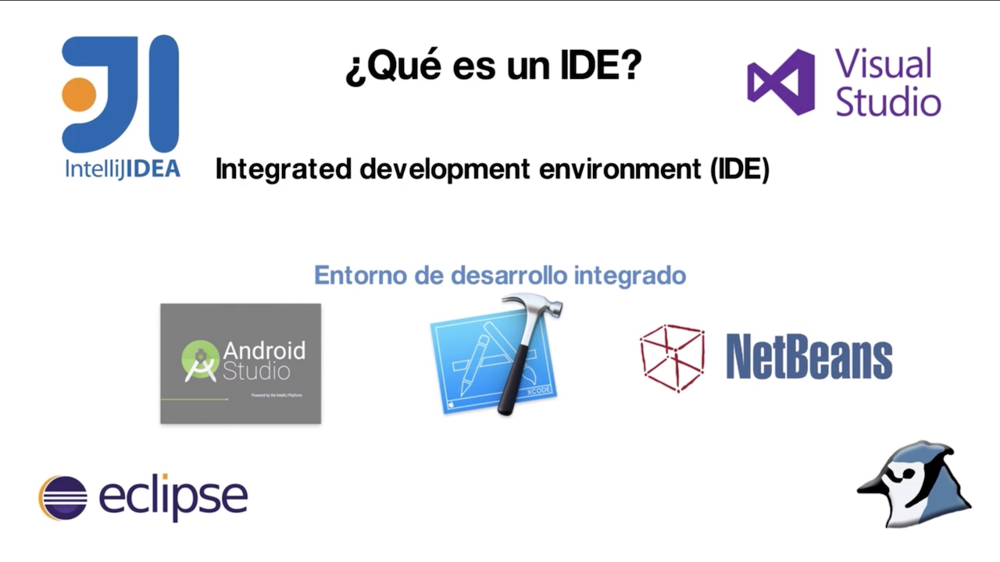

# Apuntes_ED
Apuntes de Entorno de Desarrollo - 1º DAW - Curso 17-18

## Contenidos del Módulo

[Tema 1: Elementos de Desarrollo del Software](1.ELEMENTOS.md)  
[Tema 2: Entornos Integrados del Desarrollo](2.ENTORNOS.md)  
[Tema 3: Diseño y Realizacin de Pruebas](3.PRUEBAS.md)  
[Tema 4: Optimización y Documentación](4.DOCUMENTACIÓN.md)  
[Tema 5: Elaboración de Diagramas de Clases](5.DIAGRAMA_CLASE.md)  
[Tema 6: Elaboración de Diagramas de Comportamiento](6.DIAGRAMA_COMPORTAMIENTO.md)  
